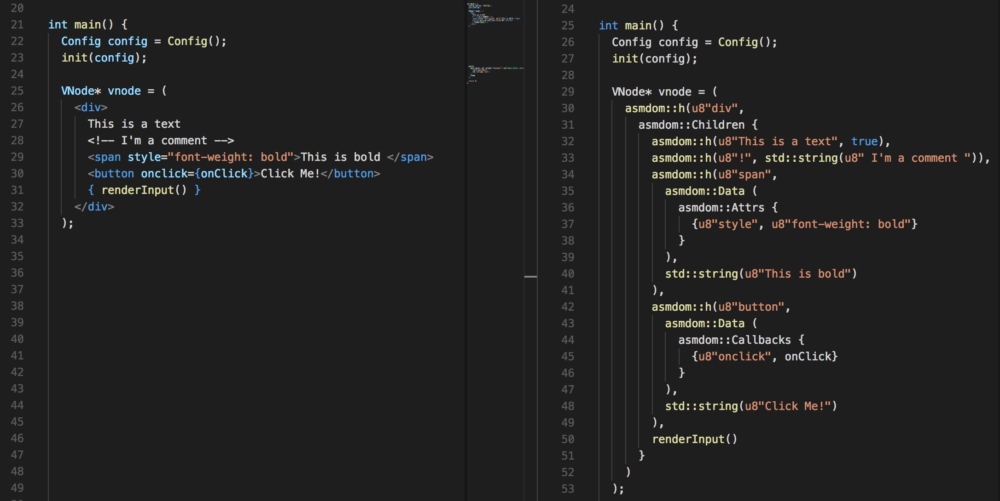

# gccx

[](https://travis-ci.org/mbasso/gccx)
[](https://www.npmjs.com/package/gccx)
[](https://www.npmjs.com/package/gccx)
[](https://github.com/mbasso/gccx/blob/master/LICENSE.md)

> Transforms CPX (JSX like syntax) into asm-dom Virtual DOM

---

**Attention - This project is still in its very early stages and isn't completed yet.**
---

---



## Motivation

[asm-dom](https://github.com/mbasso/asm-dom) Virtual DOM is a little bit verbose to write, we need a lot, not to much readable, lines of code to create a view. In addition we have to convert some types, merge attributes, props and do other stuff like that every time. For this reason we have decided to create `gccx`, a parser that allows us to write a new simple syntax. We will call this syntax `CPX`, it is based on [JSX](https://facebook.github.io/jsx/) but it has some differences. Basically `gccx` will transform this syntax into standard C++. In this way we can write files that appear very similar to HTML and can be written and read easily.

## Installation

You can install gccx using [npm](https://www.npmjs.com/package/gccx):

```bash
npm install --save-dev gccx
```

or, if you prefer, you can install gccx globally with:

```bash
npm install -g gccx
```

## Usage

Once you have installed gccx, you can use it from the command line or from javascript. Here is an example of both:

```bash
gccx src --output dist --watch
```

supposing a CommonJS environment, you can import gccx in this way and immediately use it with no configuration.

```js
import gccx from 'gccx';

const code = `
  #include "../asm-dom/asm-dom.hpp"
  #include <emscripten/val.h>
  #include <string>

  using namespace asmdom;

  int main() {
    VNode* vnode = <h1>Hello world!</h1>;

    patch(
      emscripten::val::global("document").call<emscripten::val>(
        "getElementById",
        std::string("root")
      ),
      vnode
    );

    return 0;
  };
`;

const compiled = gccx.parse(code); // compiled code as string
```

## Documentation

Visit [docs](https://github.com/mbasso/gccx/blob/master/docs) folder to find the complete doc of gccx.

## Examples

Examples are available in the [examples folder](https://github.com/mbasso/gccx/blob/master/examples). You will find examples of both, cli and javascript api usage.

## Change Log

This project adheres to [Semantic Versioning](http://semver.org/).  
Every release, along with the migration instructions, is documented on the Github [Releases](https://github.com/mbasso/gccx/releases) page.

## Authors
**Matteo Basso**
- [github/mbasso](https://github.com/mbasso)
- [@teo_basso](https://twitter.com/teo_basso)

## Copyright and License
Copyright (c) 2017, Matteo Basso.

gccx source code is licensed under the [MIT License](https://github.com/mbasso/gccx/blob/master/LICENSE.md).
